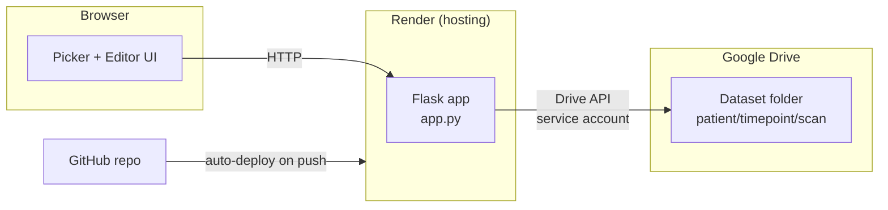

# Burn Region Polygon Editor — Live Version

A browser-based tool for reviewing/correcting SAM2-predicted burn wound
polygons on patient scan photos, plus a viewer for the other artifacts
each scan produces (segmentation overlays, alignment/feature JSON, and
3D `.ply` reconstructions). Data lives in Google Drive; the app itself
runs on Render, deployed straight from this GitHub repo.

This file is the map of how everything fits together. `README_DEPLOY.md`
is the step-by-step "how to set this up from zero" walkthrough — read
this one first for the big picture, then that one when actually deploying.

---

## 1. How the pieces connect



- **You edit code** → push to **GitHub** → **Render** notices the push,
  rebuilds, and redeploys automatically (no manual redeploy step, unless
  you're only changing an environment variable, which requires "Manual
  Deploy" on Render or triggers automatically when saved).
- **The running app** never stores scan data itself — every image, JSON,
  and `.ply` file is read from and written back to **Google Drive**
  through a service account, on every request (with a short in-memory
  cache — see §4).

---

## 2. Expected Google Drive layout

```
<DRIVE_ROOT_FOLDER_ID>/
    PAT01/
        D00/
            PAT01_D00_A/
                PAT01_D00_A.tif                       <- the scan photo
                PAT01_D00_A_burn_polygons.json         <- SAM2 / edited polygons
                PAT01_D00_A_seg.tif                    <- segmentation overlay (optional)
                PAT01_D00_A_front.png                  <- other renders (optional)
                PAT01_D00_A_burn_mask.png              (optional)
                PAT01_D00_A.ply                        <- 3D reconstruction (optional)
                PAT01_D00_A_scan_features.json         <- other metadata (optional)
                PAT01_D00_A_alignment.json             (optional)
                ...anything else...
        D14/
            PAT01_D14_A/  ...
    PAT02/
        ...
```

Rules the code relies on:
- Patient folders and timepoint folders can be named anything; timepoints
  named `D00`/`D0`/`Day0` (case-insensitive) are flagged as "Day 0" in the UI.
- Inside a scan folder, the **first non-`_seg` `.tif` file found** is treated
  as the primary scan image, and its filename (minus extension) becomes
  the `scan_id`.
- `<scan_id>_burn_polygons.json` is the primary polygon file the editor
  loads/saves. Any other file in the folder shows up in the "Other Files"
  panel instead (see §3).

---

## 3. Feature overview

### Picker (Patients → Timepoints → Scans)
`templates/patients.html` → `templates/timepoints.html` → `templates/scans.html`.
Simple drill-down list, each level backed by a route in `app.py` that
calls into `drive_storage.py`'s discovery functions.

### Polygon editor (`/edit/<scan_id>`)
`templates/editor.html` + `static/editor.js` + `static/editor.css`.
Canvas-based polygon draw/edit tool — click to place points, drag to move
them, right-click to delete, standard undo/zoom/pan. Saves back to
`<scan_id>_burn_polygons.json` on Drive, keeping a one-time
`*.sam2_backup.json` copy of the original SAM2 output before the first edit.

### "Other Files" panel (in the editor sidebar)
`static/scan_files.js` + `drive_storage.classify_scan_files()`. Lists every
file in the scan folder **except** the primary `.tif` and
`burn_polygons.json` (those are already in the main canvas), tagged by type:

| Category    | Matches                          | Click behavior                          |
|-------------|-----------------------------------|------------------------------------------|
| `mesh_3d`   | `.ply`                            | Opens the 3D viewer modal                |
| `seg_image` | `.tif` / `.tiff` (secondary)       | Converted to PNG and shown in a modal    |
| `image`     | `.png` / `.jpg` / `.jpeg`         | Shown directly in a modal                |
| `data`      | `.json` (any other json)          | Pretty-printed in a modal, read-only     |
| `other`     | everything else (`.dat`, `.lnd`…) | Opens/downloads directly, no preview     |

### 3D viewer
`static/viewer3d.js`, loaded as an ES module via an import map pointing at
jsDelivr (`three`, `OrbitControls`, `PLYLoader` — see §5 for why this
approach was chosen). Centers and normalizes the model regardless of the
source `.ply`'s original scale, with drag-to-orbit / scroll-to-zoom /
right-drag-to-pan.

---

## 4. File-by-file reference

| File                        | Role |
|-----------------------------|------|
| `app.py`                    | All Flask routes. Talks to `drive_storage.py` for data, renders `templates/`. |
| `drive_storage.py`          | Everything Drive-related: auth, the tree walk, file classification, polygon load/save. No Flask/HTTP concerns live here. |
| `templates/*.html`          | Jinja templates for each page. |
| `static/editor.js`          | Polygon canvas logic (draw/edit/save). Independent of the 3D/other-files panel. |
| `static/scan_files.js`      | Populates the "Other Files" list and the shared preview modal. |
| `static/viewer3d.js`        | Three.js 3D model viewer, exposed as `window.render3DModel()`. |
| `static/editor.css`         | Styles for all of the above. |
| `requirements.txt`          | Python deps — pinned versions, keep this exact list, don't let it drift. |
| `Procfile`                  | Render's start command (`gunicorn app:app ... --timeout 180`). |
| `render.yaml`               | Optional one-click Render Blueprint config. |
| `README_DEPLOY.md`          | Step-by-step first-time setup (Google service account, GitHub, Render). |
| `README.md`                 | This file. |

### Inside `drive_storage.py`, the important pieces:

- **`get_service()` / `_get_credentials()`** — one shared `Credentials`
  object (and thus one shared OAuth token) across every thread, but a
  separate HTTP transport per thread. See §5 for why this split matters.
- **`_build_tree()`** — walks `root → patients → timepoints → scans → files`
  **level by level**, with one bounded thread pool per level (never a pool
  nested inside another pool — see §5).
- **`get_tree()` / `invalidate()`** — the whole tree is cached in memory for
  `TREE_TTL_SECONDS` (currently 300s / 5 minutes). `save_polygons()` calls
  `invalidate()` so your own edit shows up immediately; anything added
  directly in Drive by someone else shows up within 5 minutes.
- **`classify_scan_files()`** — the categorization logic behind the "Other
  Files" panel (§3). **This is the function to edit if you want to add a
  new file type or change how something is categorized** — see §6.

---

## 5. Why some things are built the way they are

These look like unusual choices in isolation; each one fixed a real bug
hit during development, so worth understanding before "simplifying" them
back out.

- **One shared `Credentials` object, separate HTTP transport per thread**
  (`drive_storage.get_service()`). Building a brand-new credentials object
  per thread meant every new thread re-authenticated with Google from
  scratch. With several threads spun up per tree-walk level, this was
  enough simultaneous token requests that Google would slow-walk them —
  which looked exactly like the app "hanging" with no error. Sharing one
  `Credentials` object means only one token fetch total; each thread still
  gets its own transport object underneath (`httplib2.Http` isn't safe to
  share across threads for concurrent requests).

- **Explicit HTTP timeout** (`HTTP_TIMEOUT_SECONDS` in `drive_storage.py`).
  `httplib2`'s default is to wait forever on a stalled connection. Without
  an explicit timeout, a real network hiccup looks identical to the app
  being broken — no error, just an endless spinner. Now it fails loudly
  within 30 seconds instead.

- **One bounded thread pool per tree-walk level, never nested pools**
  (`_build_tree()`). An earlier version nested a pool inside a pool
  inside a pool (patients → timepoints → scans), which can spawn hundreds
  of threads at once on a larger dataset — enough to exhaust memory and
  get the whole process SIGKILLed on Render's free tier (512MB). Walking
  one flat level at a time with a single bounded pool avoids that
  entirely while still parallelizing the slow part (many small Drive API
  calls).

- **`gunicorn --timeout 180`** (`Procfile`). The first tree walk after a
  cold cache can take longer than gunicorn's 30-second default worker
  timeout, especially before the above fixes existed. 180s gives real
  headroom without masking a genuinely broken request forever.

- **3D viewer loaded via ES modules + import map, not classic `<script>`
  tags from cdnjs.** Recent three.js releases dropped the old global-script
  build that addons like `OrbitControls`/`PLYLoader` used to ship as. The
  import-map + jsDelivr approach is the currently-supported path for
  loading three.js and its addons from a CDN without a build step.

- **Recentering a loaded 3D model translates the geometry's vertices
  directly, not the mesh object's `position`.** An `Object3D` applies
  scale before position internally, so offsetting `mesh.position` in the
  model's original (pre-scale) units, then separately scaling the mesh,
  translated the recentered model to the wrong place — usually far
  outside the camera's view. Translating the geometry itself sidesteps
  the transform-order issue entirely.

---

## 6. How to extend this

**Add a new "Other Files" category** (e.g. a new file suffix that should
render specially): edit `classify_scan_files()` in `drive_storage.py` to
tag it with a new category string, then add a branch for that category in
`handleOpen()` in `static/scan_files.js` (and a matching preview route in
`app.py` if it needs server-side conversion, the way `_seg.tif` does).

**Add a new page/route:** follow the existing pattern in `app.py` — call
`ds.get_tree(_require_root_id())`, look up what you need via `ds.find_scan()`
or the `discover_*` functions, `render_template(...)`. Keep Drive-specific
logic in `drive_storage.py`, not in the route itself.

**Change how long data is cached before re-reading Drive:** adjust
`TREE_TTL_SECONDS` in `drive_storage.py`. Lower = fresher data, more Drive
API calls. Higher = fewer calls, staler data for anyone editing Drive
directly outside the app.

**Add authentication:** currently there is none — anyone with the URL can
view and edit. A simple shared-password gate (Flask session + a single
`APP_PASSWORD` env var) is a small, contained addition if this dataset
ever needs to be less than fully open.

---

## 7. Known limitations

- **Render free tier sleeps after ~15 minutes idle.** First request after
  a while takes several seconds to wake back up — this is normal, not a bug.
- **No authentication.** The URL is the only thing standing between anyone
  and full read/write access to the dataset. See §6 if this needs to change.
- **512MB memory ceiling on the free tier.** A very large dataset (many
  more patients/scans than currently) may need a paid Render instance
  rather than further tuning of the thread-pool walk.
- **Single gunicorn worker** (`WEB_CONCURRENCY=1`, Render's default based
  on free-tier CPU count) means requests are handled one at a time at the
  process level — normal for this traffic level, but worth knowing if
  usage ever grows to multiple simultaneous editors.

---

## 8. Local development

```bash
pip install -r requirements.txt
export GOOGLE_CREDENTIALS_JSON="$(cat service-account.json)"
export DRIVE_ROOT_FOLDER_ID="your-drive-folder-id"
python app.py
# -> http://127.0.0.1:5050
```

See `README_DEPLOY.md` for how to get the service account key and folder
ID in the first place.
